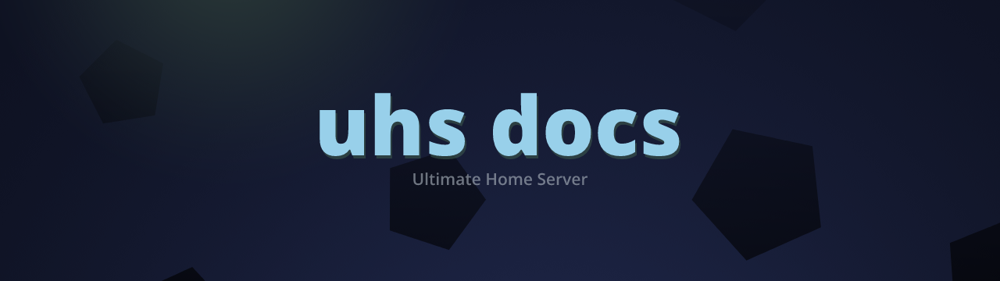

<p align="center">
  
</p>

<p align="center">
  <!-- Add shields from https://shields.io/ -->
  <a href="https://github.com/sponsors/KyleTryon">
    
  </a>
  <a href="https://github.com/TechSquidTV/ultimatehomeserver.com/actions/workflows/deploy.yml">
  
  </a>
  <a href="https://discord.gg/CTC9DVvYZz">
    
  </a>
</p>


<p align="center">
<a href="https://UltimateHomeServer.com">UltimateHomeServer.com</a>
</p>

---

Documentation for [UltimateHomeServer](https://github.com/TechSquidTV/UltimateHomeServer). Built on [Docusaurus](https://docusaurus.io/).


### Installation

```
$ npm install
```

### Local Development

```
$ npm run start
```

This command starts a local development server and opens up a browser window. Most changes are reflected live without having to restart the server.

### Build

```
$ npm run build
```

This command generates static content into the `build` directory and can be served using any static contents hosting service.
