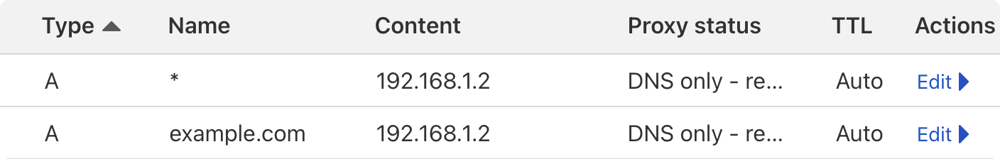

# Getting Started


## Prerequisites

- Ubuntu 20.04 (or newer) server
- A domain name
- Basic knowledge of Linux commands

### Recommended Hardware (_to run all services_)
- **CPU**: 8+ cores
- **RAM**: 32+ GB

Running only a few services should work on a _Raspberry Pi 4_ with 4 GB of RAM.

## Setup your server

In a freshly installed Ubuntu 20.04 (or newer) server, begin by ensuring your system is up to date:

```bash
sudo apt update && sudo apt upgrade -y
```

Install some useful tools:

```bash
sudo apt install -y curl git gettext-base nano 
```

### RAID storage

If you plan on using local storage and configuring a RAID array, you may want to do this now. We recommend using ZFS to create a RAIDZ1 array 3+ disks (at least, RAIDZ2 preferred). See [this guide](https://ubuntu.com/tutorials/setup-zfs-storage-pool#1-overview).

### Install K3s

[k3s](https://k3s.io/) is a lightweight Kubernetes distribution. It's a great choice for our home server because it has a small resource footprint, supports single-node clusters, and supports mounting a local path as a persistent volume.

```bash
curl -sfL https://get.k3s.io | sh -
```

### Install Helm

[Helm](https://helm.sh/) is a package manager for Kubernetes. It allows us to easily install and manage applications on our cluster.

```bash
curl -fsSL -o get_helm.sh https://raw.githubusercontent.com/helm/helm/main/scripts/get-helm-3
```

```bash
chmod 700 get_helm.sh
```

```bash
./get_helm.sh
```

### Clone this UltimateHomeServer repository

Clone UHS directory containing the Helm charts. It is recommended to clone this repository to  `/opt/<your domain>` or `/opt/uhs`:

```bash
git clone https://github.com/TechSquidTV/UltimateHomeServer /opt/<your domain>
```

## Configure a domain name

We will use a domain to access our server locally with a valid SSL certificate.

Before we begin, we will need to know the local IP address of our server. We can find this by running:

```bash
ip addr
```

You should configure your router to assign a static IP address to your server if you have not already.

1. Once you have your server's IP address, you can configure a domain name. You can obtain a domain name from a registrar of your choice.
2. In the DNS settings for your domain, create an `A` record that points to your server's IP address.
3. Create a second `A` record that points to your server's IP address, but with a subdomain of `*.`, this will be used for wildcard subdomains.




## Configure SSL

Read the [SSL](ssl) guide for instructions on how to configure SSL for your domain using certbot. This step is _required_.

## Configure Services

Read the [Configure](configure) guide for instructions on how to customize the services you want to deploy.

## Deploy Services

Read the [Deploy](deploy) guide for instructions on how to deploy the services.

## Verify Services

Read the [Troubleshooting](/docs/troubleshooting) guide for instructions on how to verify that the services are running correctly.

## Update Services

To update the services, you can run the update script with:

```bash
./bin/upgrade.sh <your domain>
```